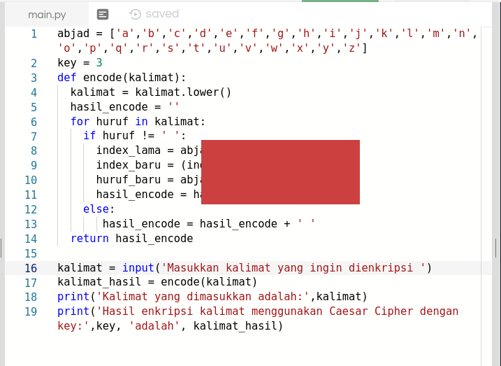
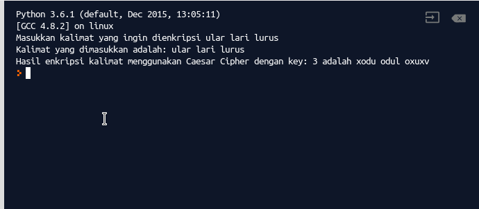

Perbaikan nilai untuk mahasiswa peserta kuliah dasar pemrograman semester ganjil 2018-2019
### Persyaratan peserta
Perbaikan nilai diberikan kepada mahasiswa dengan nilai D yang kehadiran pada perkuliahan setidaknya mencapai 75% (9 kehadiran untuk TID, 8 kehadiran untuk SIA)
### Bentuk 
Mahasiswa yang memenuhi syarat dapat mengupgrade nilai ke C bila berhasil mengerjakan tugas tambahan dan menyerahkannya via email selambat-lambatnya hari Jumat, 8 Februari 2019. 
### Tugas Tambahan

Perhatikan kode program yang ada. Sebagian dari kode dihilangkan untuk anda lengkapi. Kode tersebut merupakan sebuah contoh enkripsi sederhana menggunakan [Caesar Cipher](https://id.wikipedia.org/wiki/Sandi_Caesar). 
Tugas anda adalah melengkapi kode tersebut dengan catatan sebagai berikut:
* Key diganti nilainya dengan jumlah dari dua digit NIM terakhir anda
* Kode hasilnya dikirim paling lambat hari Jumat, 8 Februari 2019, ke alamat email ewin.sutriandi[at]gmail.com

Bahan yang dapat digunakan sebagai rujukan:
* [https://sholeh012.wordpress.com/2011/10/03/caesar-cipher-dan-cipher-key/]
 

