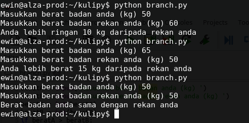

# TUGAS I  
Dasar Pemrograman 
Semester Ganjil 2018-2019

## Soal
Perhatikan gambar di bawah ini

Pada gambar diperlihatkan output sebuah program yang dijalankan tiga kali dengan input yang berbeda-beda.
Tugas anda adalah menyusun program dengan output seperti yang diperlihatkan pada gambar.

## Mekanisme pengumpulan
Tugas dikumpulkan melalui pull request. Masing-masing mahasiswa diminta membuat folder pada [alamat ini](../tugas-mhs) menggunakan nama masing-masing. Setiap tugas, misalkan tugasI diletakkan pada folder tersebut dengan nama sesuai urutan tugas (misal:tugas1.py). Lihat sampel pada alamat tersebut untuk mahasiswa bernama Loq Pelocok.

## Deadline
* Untuk kelas TI D 13 Nov 2018
* Untuk kelas SI 14 Nov 2018

